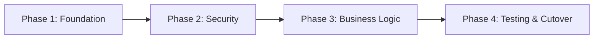

# Migration Map: {{project-name}}

**Migration ID**: {{migration-id}}
**Type**: {{migration-type}}
**Generated**: {{date}}

---

## Equivalence Map

| Legacy | Target | Migration Effort |
|--------|--------|-----------------|
| {{legacy-1}} | {{target-1}} | Low/Medium/High |

---

## Migration Phases

### Phase 1: {{phase-1-name}}

**Duration estimate**: {{duration}}  
**Risk**: Low / Medium / High  
**Files affected**: {{file-list}}

#### Tasks
- [ ] {{task-1}}
- [ ] {{task-2}}

#### Rollback Plan
```bash
git reset --hard migration/{{migration-id}}/phase-1-pre
```

#### Validation Criteria
- [ ] {{criterion-1}}
- [ ] {{criterion-2}}

---

<!-- Repeat phases as needed -->

---

## Dependency Order



---

## Rollback Checkpoints Summary

| Phase | Git Tag | Created | Status |
|-------|---------|---------|--------|
| Phase 1 | `migration/{{migration-id}}/phase-1-pre` | | ⏳ |

---

## Next Step

Run `/onex.migrate.execute` to start the incremental transformation.
